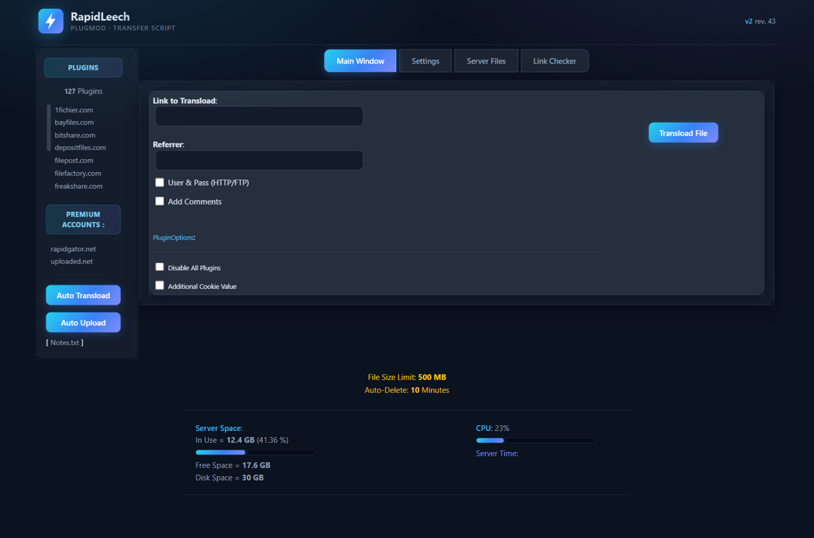
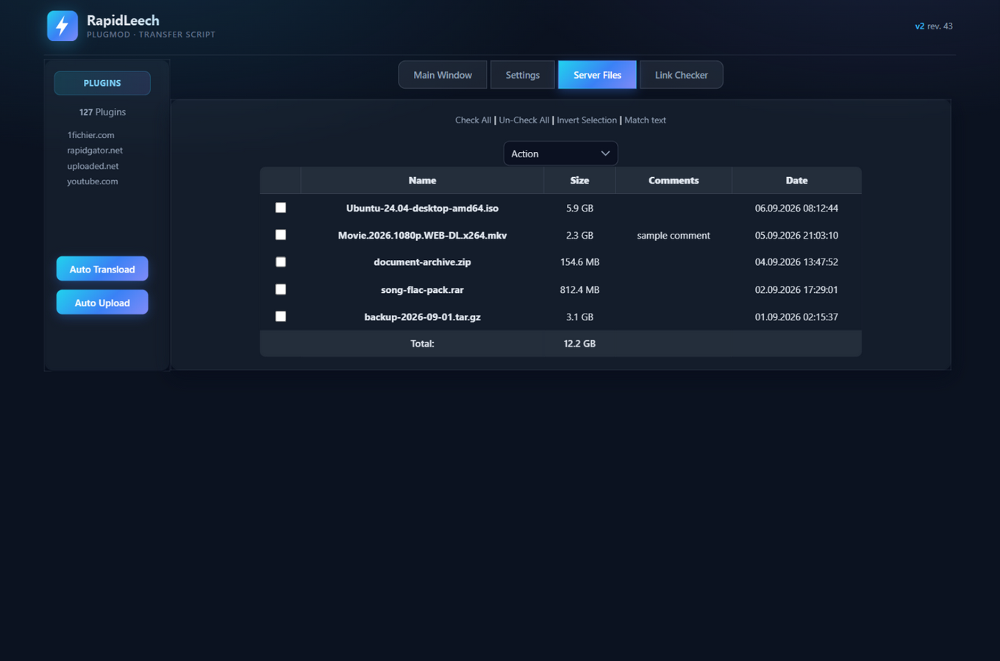

<p align="center">
  
</p>

<h1 align="center">RapidLeech PlugMod</h1>

<p align="center">
  <b>A free, plugin-based server-to-server transfer script with a modern dark UI.</b><br/>
  Transfer files between file-hosting services at the full speed of your server — no database required.
</p>

<p align="center">
  <a href="https://github.com/tahatehran/rapidleech/commits/master"></a>
  <a href="https://rapidleech.com/forum/"></a>
  
  
</p>

---

## 📖 About

RapidLeech transfers files from other file-hosting servers **to your own server** using your server's fast connection, then lets you download them any time you want. It works with 127+ popular file-hosting sites (uploaded.net, Rapidgator.net, and many more) through its plugin system.

The script has been used by millions of users and installed on thousands of servers worldwide. Installation is extremely easy and **does not require any database**.

> This repository is a maintained fork of the official (now read-only) RapidLeech repo, kept alive so users can continue to receive updates. New maintainers are welcome — contact: `ept6f5mugkd3 [at] opayq [dot] com`

## ✨ Modern UI (new)

The default **PlugMod** template was fully redesigned with a fresh dark theme:

- 🎨 Modern dark "midnight" theme built with CSS variables
- 🧊 Glass-style cards, rounded corners and soft shadows
- 💠 New gradient logo, favicon and accent gradient tabs & buttons
- 📊 Server disk / CPU usage shown with live CSS meters
- 📱 Responsive layout — works on phones and tablets
- 📝 HTML5 markup with proper viewport & mobile-friendly forms

| Dashboard | Server Files |
| --- | --- |
|  |  |

## 🚀 Features

- **Transload** — download files directly from one host to your server
- **Auto Transload** (`audl.php`) — queue many links and download them one after another
- **Auto Upload** (`auul.php`) — upload your server files to supported file hosts
- **Link Checker** — check the status of hosted links (via `ajax.php`)
- **File manager** — rename, move, delete, split, merge, pack (TAR/ZIP), unpack, MD5/SHA1/CRC32 hashing and more
- **Premium accounts** — store server-side premium credentials in `configs/accounts.php`
- **Multi-language UI** — English, Persian, Arabic, German, Spanish, French, Italian, Portuguese, Thai, Turkish
- **HTTP Basic authentication** — protect the panel with users & passwords
- **No database needed** — everything is file-based

## 📋 Requirements

| Component | Requirement |
| --- | --- |
| PHP | 7.4+ recommended (older 5.x/7.x generally work) |
| PHP settings | `fsockopen` or cURL enabled, `allow_url_fopen` recommended |
| Optional | GD extension (server meters), `rar`/`unrar` binaries (Linux) for RAR actions |
| Web server | Apache, Nginx, or any server that runs PHP |

Run `checker.php` after uploading to verify your server meets everything.

## ⚡ Installation

1. Upload all files to a folder on your web server (e.g. `public_html/rapidleech/`).
2. Make sure these paths are writable (chmod `755` or `777` depending on your host):
   - `configs/` — configuration and `files.lst`
   - `files/` — your download storage
3. Open the script in your browser. On first run the **setup wizard** (`configs/setup.php`) creates `configs/config.php` automatically.
4. Protect your installation: open `configs/setup.php` → *Login* section and enable **HTTP Basic authentication** with your users.
5. Done — start transloading! 🎉

## 🔧 Configuration

- `configs/setup.php` — full web-based configuration wizard (templates, languages, limits, actions, login…)
- `configs/default.php` — default option values
- `configs/accounts.php` — premium accounts used server-side
- `hosts/` — download & upload host plugins (drop new `.php` plugins in `hosts/download/`)

### Useful options

| Option | Where | Effect |
| --- | --- | --- |
| `login` + `users` | Setup → Login | Require username/password (HTTP Basic) |
| `delete_delay` | Setup → Advanced | Auto-delete files after N seconds |
| `file_size_limit` | Setup → Advanced | Maximum transload size per file |
| `template_used` | Setup → Presentation | Active template (`plugmod` = modern dark UI) |
| `bw_save` | Setup → Advanced | Forbid leeching from your own server |

## 🔒 Security Notice

RapidLeech is a **powerful tool** — anyone who can reach it can use your server's bandwidth.

- Always enable the **login** option before going public.
- Keep the script in a folder that is not publicly listed, and monitor `files/` growth.
- Host it at your own risk; the authors take **no responsibility** for misuse.

## 🗂 Project Layout

```
rapidleech/
├── index.php          # Main entry — transload engine
├── audl.php           # Auto Transload (queue downloads)
├── auul.php           # Auto Upload (upload to hosts)
├── upload.php         # Upload runner (used by auul)
├── ajax.php           # AJAX backend (link checker, server stats)
├── checker.php        # Server requirements checker
├── classes/           # Core engine (http, ftp, image, options…)
├── configs/           # Configuration, accounts, file list
├── hosts/             # Download / upload host plugins
├── languages/         # UI translations
├── templates/         # UI themes
│   └── plugmod/       # ★ Default — modern dark theme
└── files/             # Downloaded files storage
```

## 💬 Support

- 🌐 Community: [Rapidleech Support Forum](https://rapidleech.com/forum/)
- 🐛 Issues: open an issue in this repository

## 🙏 Credits & Disclaimer

RapidLeech PlugMod is the result of many contributors over the years — original script by **Eqbal**, major revisions by the PlugMod team, link checker by **Dman (MaxW.org)** optimized by *zpikdum* & *sarkar*, mod by *eqbal*, ajax'd by *TheOnly92*, updated by *Th3-822*, and maintained by the community.

> **Disclaimer:** This script is provided **as-is**, with no warranty of any kind. The authors and maintainers are not responsible for how you use it, for any data loss, or for any damage caused by the script. Using it against the terms of service of other websites is done at your own risk. Please respect the laws of your country and the rules of the hosts you interact with.
